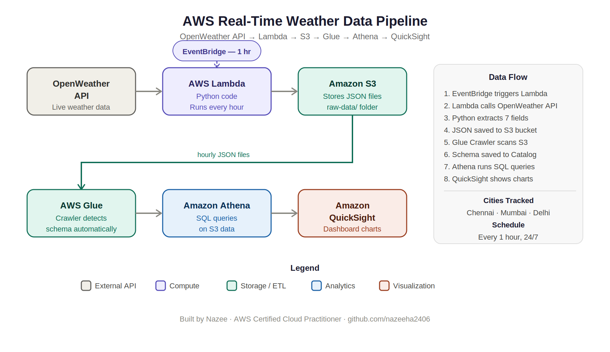

# AWS Real-Time Weather Data Pipeline

An end-to-end serverless data pipeline that automatically collects live weather data for multiple cities every hour, stores it on AWS S3, and visualizes insights through an interactive dashboard.

---

## Architecture

```
OpenWeather API
      |
      v
AWS Lambda  <-- EventBridge (every 1 hour)
      |
      v
Amazon S3 (raw JSON files)
      |
      v
AWS Glue Crawler (auto-detects schema)
      |
      v
Amazon Athena (SQL queries on S3)
      |
      v
Amazon QuickSight (dashboard & charts)
```

---

## What This Project Does

- Fetches live weather data (temperature, humidity, wind speed) for **Chennai, Mumbai, Delhi**
- Runs **automatically every hour** using AWS Lambda + EventBridge — no manual work needed
- Stores each city's data as a separate JSON file in **Amazon S3**
- Uses **AWS Glue Crawler** to automatically detect data structure and create a queryable table
- Queries weather trends using **SQL on Amazon Athena** — no database server needed
- Visualizes insights on an **Amazon QuickSight** dashboard with bar charts and trend analysis

---

## AWS Services Used

| Service | Purpose |
|---|---|
| AWS Lambda | Runs Python code automatically every hour |
| Amazon EventBridge | Triggers Lambda on a schedule (rate: 1 hour) |
| Amazon S3 | Stores raw weather JSON files |
| AWS Glue Crawler | Scans S3 and auto-detects data schema |
| AWS Glue Data Catalog | Stores table metadata for Athena to query |
| Amazon Athena | Runs SQL queries directly on S3 data |
| Amazon QuickSight | Builds visual dashboard from Athena data |
| AWS IAM | Manages permissions between services |

---

## Tech Stack

- **Python 3.12** — data fetching, transformation, S3 upload
- **boto3** — AWS SDK for Python (S3 operations)
- **urllib** — HTTP requests to OpenWeather API (Lambda compatible)
- **python-dotenv** — manages secrets locally via .env file
- **SQL** — weather trend analysis in Athena
- **JSON** — data format for storage and transfer

---

## Project Structure

```
aws-weather-pipeline/
  fetch_weather.py       <- Local script: fetch + save to S3
  lambda_function.py     <- AWS Lambda function code
  queries.sql            <- Athena SQL queries used for analysis
  requirements.txt       <- Python dependencies
  .env                   <- Secret keys (NOT uploaded to GitHub)
  .gitignore             <- Prevents .env from being pushed
  README.md              <- This file
```

---

## Sample Data

Each hourly run saves a JSON file like this to S3:

```json
{
  "city": "Chennai",
  "temperature": 34.78,
  "feels_like": 41.78,
  "humidity": 69,
  "wind_speed": 7.2,
  "description": "few clouds",
  "timestamp": "2026-05-02 15:19:04"
}
```

S3 path format:
```
s3://weather-pipeline-nazee/raw-data/chennai_2026-05-02_15-19-04.json
```

---

## SQL Queries (Athena)

```sql
-- View all weather data
SELECT * FROM raw_data LIMIT 10;

-- Hottest city
SELECT city, MAX(temperature) AS max_temp
FROM raw_data
GROUP BY city;

-- Average humidity per city
SELECT city, ROUND(AVG(humidity), 2) AS avg_humidity
FROM raw_data
GROUP BY city;

-- Chennai records only
SELECT * FROM raw_data
WHERE city = 'Chennai'
ORDER BY timestamp DESC;

-- Total records per city
SELECT city, COUNT(*) AS total_records
FROM raw_data
GROUP BY city;
```

---

## How to Run Locally

**1. Clone the repo**
```bash
git clone https://github.com/nazeeha2406/upgraded-tribble.git
cd upgraded-tribble
```

**2. Install dependencies**
```bash
pip install -r requirements.txt
```

**3. Create .env file**
```
API_KEY=your_openweather_api_key
BUCKET_NAME=your_s3_bucket_name
```

**4. Configure AWS credentials**
```bash
aws configure
```

**5. Run the pipeline**
```bash
python fetch_weather.py
```

---

## Key Learnings

- Serverless architecture design on AWS
- REST API integration using Python
- boto3 for S3 operations
- Event-driven automation with Lambda + EventBridge
- ETL pipeline concepts (Extract, Transform, Load)
- Serverless SQL querying with Athena
- Data visualization with QuickSight
- IAM roles and permissions management
- Securing secrets with .env and .gitignore

---

## Architecture


---

## Author

**Nazee**
Aspiring Data Cloud Engineer | AWS Certified Cloud Practitioner

- GitHub: [nazeeha2406](https://github.com/nazeeha2406)
- LinkedIn: [Nazeeha](https://www.linkedin.com/in/a-nazeeha)

---

## License

MIT License — free to use and modify.
